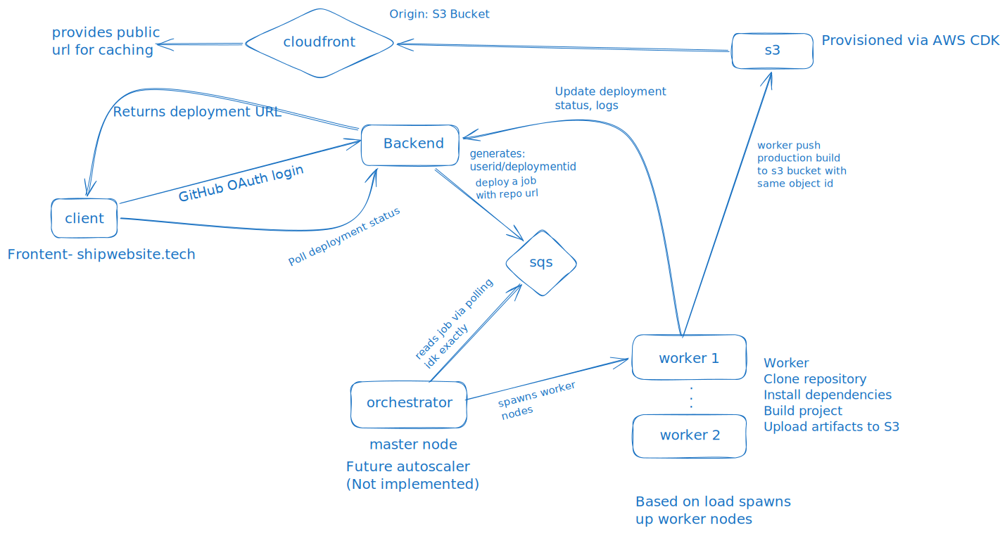

# infra-orchestrator

A simplified Vercel-like deployment system for static builds.

This project is built as a learning challenge. For now, it supports static builds only. Future features may be added later.

## Workflow


## Architectural Decisions

I have decided to go with the low cost deploy architecture as I would love to save my money. For backend I chose AWS Lambda in production as the server, and to create deployments I needed longer duration workers. AWS Lambda could do the job if the build was within its runtime limit, but I preferred to use an Oracle Cloud worker which I had just rotting away. I could have used EC2 here, but I am out of free credits.

To create a truly distributed and highly scalable model, SQS was the easier choice as all I had to do was push deployment messages into SQS and my Oracle worker would long poll it to read them. Preventing deduplication and implementing a DLQ is also easier and more optimal. The other option was RabbitMQ, but it felt like overkill. If the operational complexity increases in the future, I would consider RabbitMQ instead.

Another alternative to this model is using SQS + Event Source Mapping (ESM) + Lambda workers, which is essentially a managed polling service by AWS. The operational complexity of this managed model is very low, but I chose not to use it because the deployment process is multi-stage—cloning, building, and pushing production code to S3—which can take time. After the build completes, the S3-hosted code is served through the AWS CDN edge network.

## Directory Structure

```text

├── apps
│   ├── backend      # API server
│   ├── executor     # Build worker
│   ├── frontend     # Web UI (Not implemented rn)
│   └── scheduler    # Scheduled jobs (Not implemented rn)
├── assets
│   └── workflow.svg
├── infra            # AWS CDK infrastructure
├── nginx            # Nginx configuration (Not implemented rn)
├── packages
│   └── shared       # Shared types and utilities
├── package.json
├── pnpm-workspace.yaml
└── tsconfig.base.json
```

Everybody is Free to Contribute !!